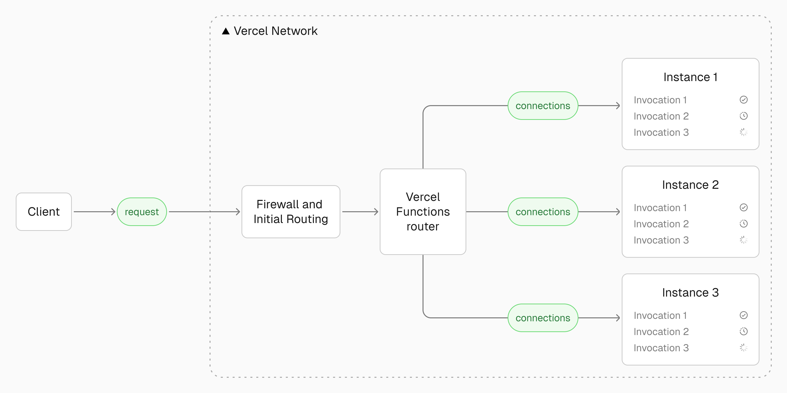

import IOBounds from './custom-tooltip.tsx'

The way we host and run applications has changed dramatically over the years. Let's see how we evolved from traditional physical machines to the latest concepts in edge and fluid computing.

## Dedicated Servers

- **Definition:** Physical machines which were actual computers which run your hosted application. Still used today and could be used with virtualization to run multiple applications on the same machine.
- **Operation:** They are always on, handle traffic in parallel, and need to be scaled manually.
- **Model:** Operate on a centralized model where the server can be a single point of failure. This can be seen as good as you have more control, and data management is streamlined.
- **Benefits:** This provides consistent performance, security, and reliability since you know exactly how the data is being handled and where it is being stored.
- **Management:** Uptime, power supply, connection speed, and similar factors depend on your management.
- **Limitations:** Optimizing performance beyond the hardware's capabilities requires manual scaling (upgrading or adding more hardware). Complex deployment, scaling, and management can potentially delay the time-to-market for critical applications.
- **Cost:** High upfront costs, maintenance, and management overhead. You are paying for the hardware and the time it takes to manage it.

## Edge Computing and CDNs

To tackle the problem of latency, which occurs when the server is geographically far from the client (a common issue as the internet grew), Content Delivery Networks (CDNs) & Edge Computing emerged. These involve a network of servers or a distributed computing paradigm spread across the globe. This allows content to be cached closer to the user, significantly reducing latency.

> Traffic patterns are also something to keep in mind here. If you have high traffic during the day from one region but not another, managing server uptime efficiently becomes complicated with things like timezones, especially when trying to cut costs or scale with a centralized dedicated server.

This distributed approach started to make applications feel more _responsive_ and _faster_ since data is served from a geographically nearby server.
Being decentralized with multiple servers also simplifies scaling and reduces bandwidth consumed by transferring data to distant centralized servers.
Cloudflare is a good example of a catalyst for this change, making edge deployment easier with offerings like Cloudflare Pages and Cloudflare Workers.

### Cloudflare Pages

- **Performance:** Improved performance and reduced latency by serving static assets from the nearest edge location to the user.
- **Scalability & Reliability:** Automatic scaling and load balancing across multiple edge locations ensure high availability and reliability.
- **Security:** Built-in security features, such as DDoS protection, Web Application Firewall (WAF), and free SSL certificates (Secure Sockets Layer) to encrypt data in transit, safeguard applications from threads.
- **Use Case:** Primarily built for static sites, making it harder to use directly for highly dynamic applications.
- **Framework Support:** Despite limitations for dynamic content, JAMStack frameworks (React, Next.js, Gatsby, Vue, Hugo, Jekyll) are well-supported.

## Serverless Computing

The term "Serverless" can be misleading; it's perhaps better described as "server-less" management or even "lazy servers".

- **Event-Driven & Scalable:** Serverless functions are event-driven (e.g., triggered by HTTP requests) and automatically scale based on demand.
- **Managed Infrastructure:** No need to manage underlying servers or infrastructure, allowing developers to focus solely on writing code.
- **Statelessness:** Functions are typically stateless; persistent state needs to be stored externally in a database or other storage solution.
- **Lifecycle:** Instances "die" or spin down when not actively used, hence the "lazy" aspect.
- **Concurrency Model:**
  - Each instance typically serves one request at a time. A new request often gets a new compute node/dedicated Virtual Machine (VM) for its duration.
  - How is concurrency handled? While dedicated servers handle concurrency using threads within a single machine, traditional serverless functions often achieve concurrency by spinning up multiple VMs—one for each concurrent request.
  - You aren't blocking and waiting for a response from one instance; instead, a new VM is spun up for each concurrent request, even if an existing VM is about to finish.
  - To mitigate issues like cold starts (the delay in spinning up a new VM) and improve user experience, developers implemented strategies like caching and techniques to keep function instances "warm".
- **Ideal Use Cases:** This model excels at short-lived tasks requiring low latency and quick response times.
- **Limitations:** Long-lived requests aren't ideal, as they can lead to inefficient resource use (keeping potentially many VMs active). The "cold start" problem can also impact the performance of infrequently used functions.

  
A bit more into the Concurrency Model on Serverless

This model describes the common approach to handling requests in many serverless platforms.

**Core Concurrency Model:**

- **One Request per Instance:** Typically, each function instance (which might be a container or a dedicated micro-Virtual Machine/VM) serves only **one user request at a time**. A specific instance is allocated for the duration of that single request.
- **Concurrency via Instance Scaling:** Unlike dedicated servers that often use multi-threading within a single machine to handle concurrent requests, traditional serverless platforms achieve concurrency primarily by **scaling the number of instances**.
  - If multiple requests arrive concurrently, the platform automatically spins up multiple, separate instances – essentially one VM per concurrent request.
- **No Blocking/Waiting:** The system doesn't typically block and wait for an existing instance to finish before handling a new request. It favors **immediately spinning up a new VM** for the new request, even if another VM is about to complete its task.

**Implications and Challenges:**

- **Cold Starts:** A significant challenge is the "cold start" – the delay incurred when a new VM must be initialized and started before it can process a request. This impacts the performance of infrequently used functions or during sudden traffic spikes.
- **Resource Usage for Long Tasks:** This model can be inefficient for long-lived requests. Since each concurrent long request might occupy its own dedicated VM, it can lead to **spinning up many machines and potentially wasting resources** while they run.
- **Developer Mitigations:** To improve user experience and performance, developers implement strategies like:
  - **Caching** responses.
  - Techniques to keep function instances **"warm"** (ready to serve requests without a cold start).
  - Sometimes accepting slightly longer response times to manage resources.

**Ideal Use Cases & Limitations:**

- **Best Fit:** Excels at **short-lived tasks** requiring low latency and quick, independent responses.
- **Less Ideal For:** **Long-running processes** due to potential resource inefficiency and the cost associated with keeping many instances active.

**The Forward-Looking Question:**

- The limitations of this model lead to the question: **What if a single serverless function/lambda instance could handle multiple requests concurrently**, similar to dedicated servers? This approach could potentially mitigate cold starts (as fewer instances need starting) and improve overall resource utilization.
  [How AWS deals with Lambda functions](https://youtu.be/156FSMbyMPQ?si=9cPaC3JFAMjNO8rR&t=840)
  > This whole note is inspired by this video HUGE shoutout to [@theo](https://twitter.com/theo) for his nerdy deep dives!!

## Fluid Computing

Fluid computing aims to blend the benefits of dedicated servers (resource utilization) and serverless functions (scalability, managed infrastructure) into a hybrid model. The key idea is **optimizing concurrency**—making sure resources are fully utilized rather than spinning up a new VM for every single request unless absolutely necessary. This involves enabling "in-function concurrency" or multithreading within a single function instance.

- **Efficiency:** There are moments in asynchronous code execution (like waiting for network requests) where a server isn't actively processing. Fluid computing takes advantage of this downtime within a single instance to handle other requests, making it more cost-effective.
- **Optimized Concurrency:** This allows a single lambda/function instance to handle multiple concurrent invocations. This is a departure from the traditional serverless model where each invocation often gets its own isolated instance. Optimized concurrency leads to more efficient use of compute resources and can reduce idle time, especially for I/O-bound tasks (uses concurrecy to improve efficiency since its usually waiting during input/output or connecting with db and stuff) (common in AI applications waiting for external data).

- **Complex State Management:** Unfortunately allowing multiple invocations within the same process requires careful consideration of potential issues related to shared global state and request isolation.

> "Traditional Serverless wastes idle time. It fails to efficiently utilize available resources during periods of inactivity."

Fluid compute models often aim to bill based on actual CPU time used, rather than billing for the entire time an instance is active, including idle time. Techniques like pre-warmed instances (in rust btw 🦀) and bytecode caching further reduce cold starts, making these models suitable for demanding applications like AI.
Fluid compute models often support dense global compute and multi-region failover.

[Amazing Example of Fluid Compute in Action](https://fluid0.vercel.app/)

### Platforms Embracing Fluid Concepts

The downtime mentioned before is also still chipping into your cost though, yes you can now parellelize during down time to effectively reduce that cost, but you are still being charged for it no matter how long it is!

A central and defining concept within the fluid compute paradigm is optimized concurrency. This refers to the capability of a single function instance to handle multiple concurrent invocations simultaneously. This is a departure from the traditional serverless model where each invocation typically spins up its own isolated instance. Optimized concurrency leads to more efficient utilization of underlying compute resources and can significantly reduce idle time, especially for input/output (I/O) bound tasks that are frequently encountered in AI applications, where functions might spend a significant portion of their execution time waiting for responses from external services or data sources.
Allowing multiple invocations to share the same underlying process requires careful consideration of potential issues related to the sharing of global state and the isolation of individual requests.

- **Cloudflare Workers:** Offer an interesting approach using **V8 isolates**.
  - V8 isolates (similar to how browser tabs isolate JavaScript environments) are a lightweight way to run multiple instances of code in parallel securely (since v8 is one of the most battle-tested and most scrutinized engine sandbox ) and in parallel within a single process/VM.
  - They are really good at dealing with issues like cold-starts since they are so lightweight, and also idle time is reduced because of JavaScript's eventloop being designed neatly to handle async code and I/O bound tasks.
  - This allows Workers to handle significant concurrency within one instance and spin up new compute capacity very quickly during CPU downtime.
  - Crucially, this model allows Cloudflare to bill primarily based on **CPU time** used, not wall-clock time, avoiding charges for idle time within a request.
  - Workers run at the edge(reverse-proxy like exist before intercepting the server kinda like cache), intercepting and modifying HTTP requests/responses in real-time. They are written in JavaScript (using the Service Workers API) and executed on the efficient Chrome V8 engine, benefiting from its battle-tested sandbox and familiarity for web developers. Cloudflare's early adoption positioned Workers well within the serverless evolution.
- **Vercel Fluid:** Explicitly markets a "Fluid Compute" model aimed at optimized concurrency and reduced idle time, particularly targeting AI workloads.
- **Google Cloud Run:** Allows developers to deploy containerized applications (OCI-compliant Docker images) and deploy to the GCR (Google Cloud Registry) which are stateless containers. It supports concurrent requests per container instance and offers a scale-to-zero capability. Billing can be based on CPU allocation and request processing time. It uses technologies like gRPC for efficient communication but might involve a more complex developer experience related to containerization.
- **AWS Lambda:** While traditionally following the one-request-per-instance model, AWS has also introduced features and configuration options to influence concurrency and reduce cold starts (like Provisioned Concurrency).
- **Deno Deploy:** Also operates on V8 isolates I believe and aims for efficient, edge-based execution with billing potentially tied closer to actual usage.

## Server Architecture Comparison

| Feature                | Dedicated Servers                                 | Cloudflare Pages        | Cloudflare Workers           | Fluid Compute (e.g., AWS wrapper) | AWS Lambda                                   | Google Cloud Run               |
| ---------------------- | ------------------------------------------------- | ----------------------- | ---------------------------- | --------------------------------- | -------------------------------------------- | ------------------------------ |
| Cost                   | High, fixed                                       | Low, usage-based        | Low, usage-based             | Potentially low, usage-based      | Low, usage-based                             | Low, usage-based               |
| Scalability            | Limited, manual                                   | High, automatic         | High, automatic              | High, automatic, efficient        | High, automatic                              | High, automatic                |
| Control                | Full                                              | Limited                 | Moderate, code-level         | Moderate, code-level              | Limited, code-level                          | Moderate, pick your language   |
| Performance            | Excellent, consistent                             | Excellent for static    | Excellent, low latency       | Excellent, optimized              | Good, potential cold starts                  | Good, potential cold starts    |
| Operational Complexity | High                                              | Low                     | Moderate                     | Moderate                          | Low                                          | Low-ish (depends on container) |
| Security               | High, user-managed                                | Mid, Cloudflare-managed | High, Cloudflare-managed     | High, provider-managed            | High, AWS-managed                            | High, provider-managed         |
| Typical Scenarios      | High-traffic, enterprise, gaming, HPC, compliance | Static sites, JAMstack  | Edge logic, APIs, middleware | AI, real-time apps, streaming     | Event-driven, data processing, microservices | Web apps, APIs, microservices  |

## Further Reading

### Documentation

- [AWS Lambda](https://aws.amazon.com/lambda/)
- [Cloudflare Pages](https://developers.cloudflare.com/pages/)
- [Cloudflare Workers](https://developers.cloudflare.com/workers/)
- [Vercel Fluid Compute](https://vercel.com/docs/functions/fluid-compute)
- [Google Cloud Run](https://cloud.google.com/run/docs)

### Articles

- [A Brief History of Hosting](https://www.icdsoft.com/blog/a-brief-history-of-hosting/) - ICDSoft
- [The Evolution of Web Hosting](https://blog.hansoninc.com/the-evolution-of-web-hosting/) - Hanson Inc.
- [Why Vercel Overhauled Its Serverless Infrastructure for the AI Era](https://www.runtime.news/why-vercel-overhauled-its-serverless-infrastructure-for-the-ai-era/) - Runtime News
